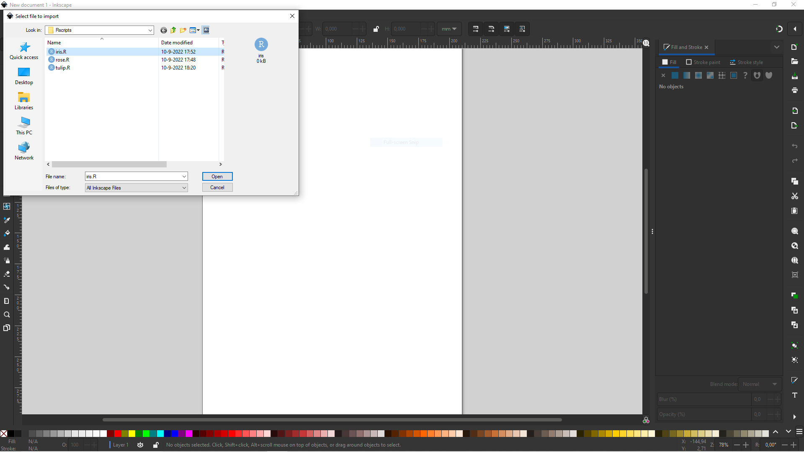
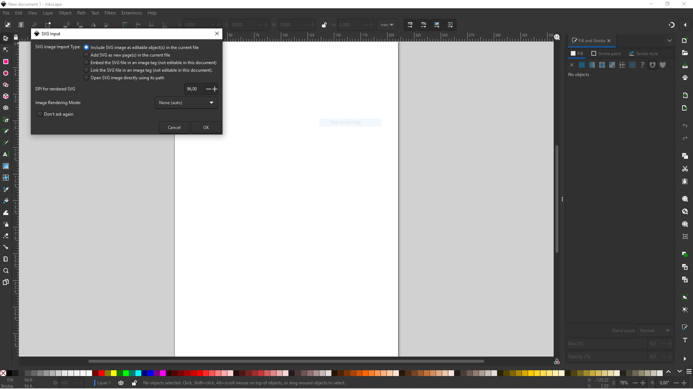
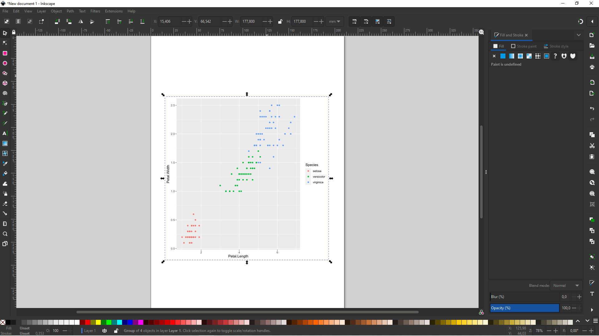
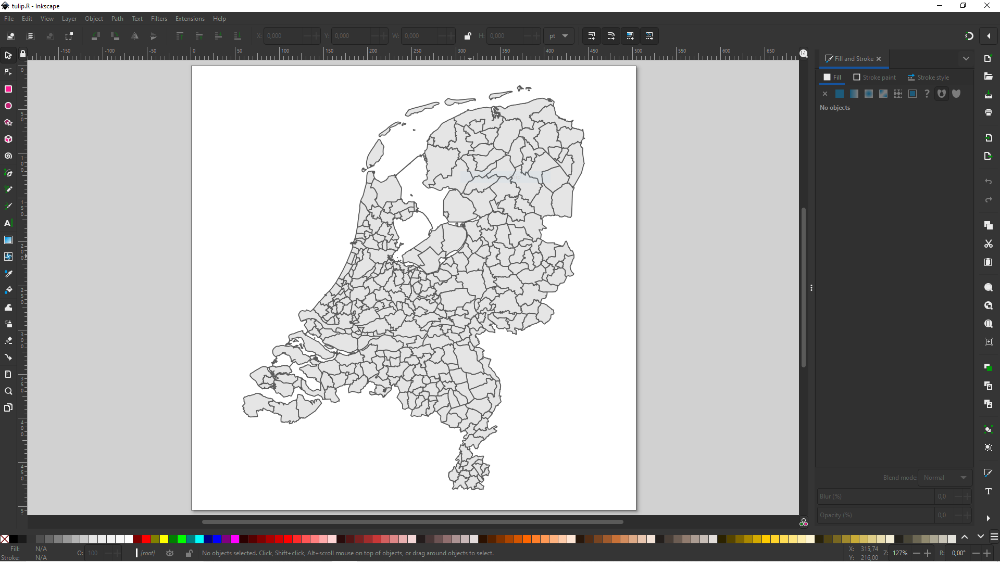

# impoRt
impoRt is an Inkscape extension for executing R scripts from Inkscape to represent the resulting R plot inside the Inkscape canvas.

# Requirements

Strictly R and Inkscape must be installed on the platform. 

# Extension set up

1. Make sure the `PATH` to` Rscript` is set in the Environment Variables of your system.

2. Files :

- `r_import.py` 

- `r_import.inx`

must be in the User Extensions directory which is listed at `Edit`>`Preferences`>`System` - `User Extensions`: in Inkscape.

# Rscripts

In order for the script to run correctly, it must meet the following convention:

```
#!/usr/bin/env Rscript
args = commandArgs(trailingOnly = TRUE)
# Your code starts here
....................
# Your code ends here
ggsave(filename = args[1] , plot = ...)

```

in place of dots you can type whatever you want.

# Why does it work?

After importing (or opening) R script with Inkscape: 



Inkscape builds command like:

`Rscript script.R output.svg` which is executed by the system. At that time your script creates `args` variable where keeps the name of the output. That name is next passed to `ggsave` and your `plot` is saved there. At the end Inkscape loads the output into canvas. Easy !

When using `Import` a popup will show:



# Examples

In the `tests` folder you can find `iris.R` script with following content: 

```
#!/usr/bin/env Rscript
args = commandArgs(trailingOnly = TRUE)
# Your code starts here
library(tidyverse)

plot <- iris %>%
  ggplot() +
  aes(x = Petal.Length,
      y = Petal.Width,
      colour = Species) +
  geom_point()

# Your code ends here
ggsave(filename = args[1] , plot = plot)
```

after import you should see in Inkscape:



Another example, script `rose.R`:

```
#!/usr/bin/env Rscript
args = commandArgs(trailingOnly = TRUE)
# Your code starts here
library(tidyverse)
library(sf)

st_rose = function(x) {
  p = x %>% select(p) %>% pull()
  q = x %>% select(q) %>% pull()
  n = x %>% select(n) %>% pull()
  tibble(theta = seq(0, n * pi, length.out = 100)) %>%
    mutate(r = 1 * cos(p / q * theta)) %>%
    mutate(x = r * cos(theta)) %>%
    mutate(y = r * sin(theta)) %>%
    select(x, y) %>%
    as.matrix() %>%
    list() %>%
    st_multilinestring() %>%
    st_sfc()}

plot <- tibble(p = 3, q = 5) %>% 
  mutate(n = ifelse((p * q) %% 2 == 0, 2 * q, 1 * q)) %>%
  st_rose() %>%
  ggplot() +
  geom_sf()

# Your code ends here
ggsave(filename = args[1] , plot = plot)

```

after open you should see in Inkscape:


The rose curve is well described at https://en.wikipedia.org/wiki/Rose_(mathematics) and using 'SIMPLE FEATURES' to build them is a bit extravagant. Truth :)

The last example from script `tulip.R` :

```
#!/usr/bin/env Rscript
args = commandArgs(trailingOnly = TRUE)
# Your code starts here
library(tidyverse)
library(sf)

plot <-
  "https://geodata.nationaalgeoregister.nl/cbsgebiedsindelingen/wfs?request=GetFeature&service=WFS&version=2.0.0&typeName=cbs_gemeente_2022_gegeneraliseerd&outputFormat=json" %>%
  st_read() %>%
  ggplot() +
  geom_sf() +
  theme_void()

# Your code ends here
ggsave(filename = args[1] , plot = plot)

```



# References

https://inkscape.gitlab.io/extensions/documentation/tutorial/my-first-import-extension.html
