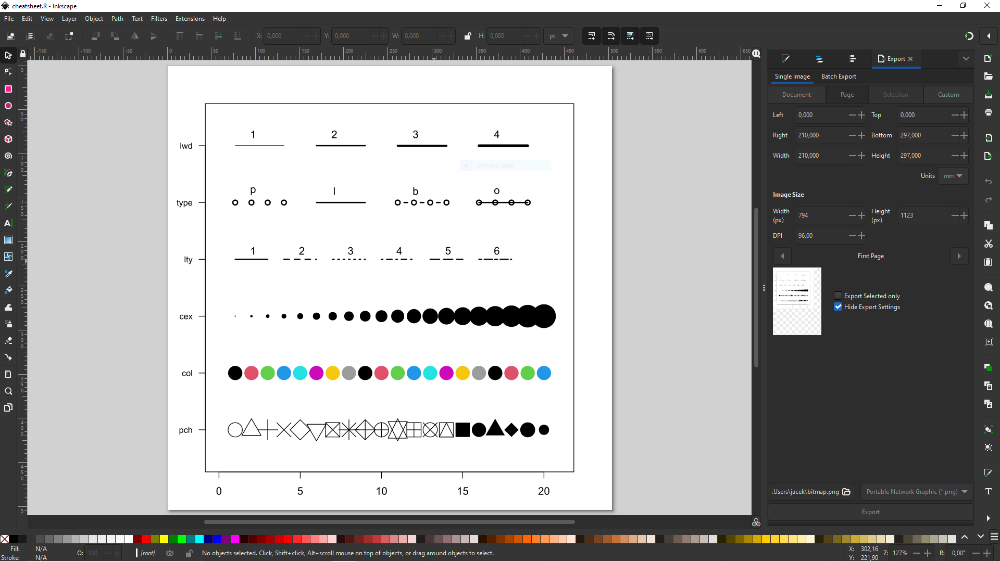
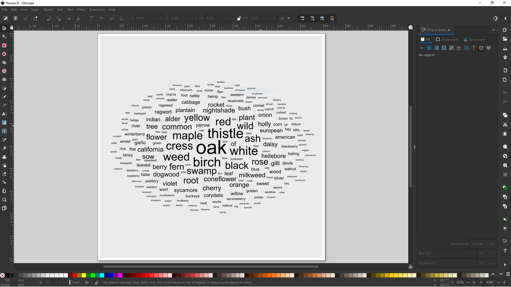
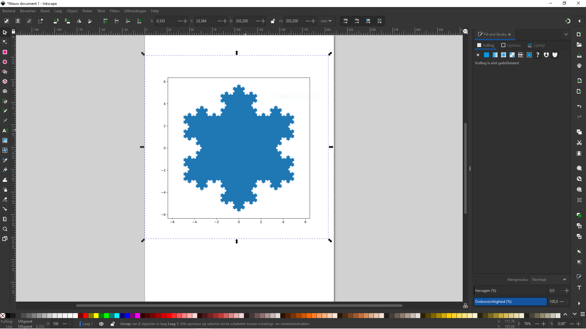
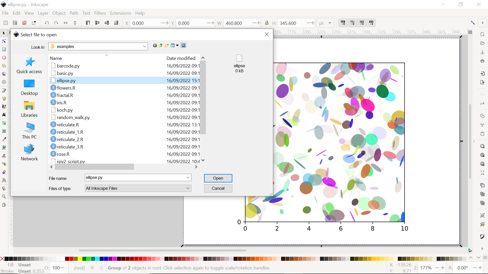
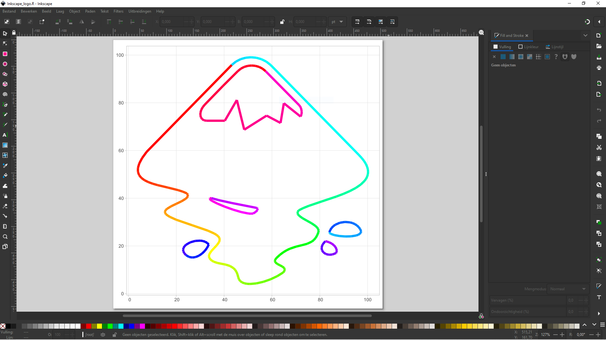

# R & Python Import Extensions for Inkscape

Inkscape extensions for executing R/Py scripts from Inkscape to represent the resulting R/Py plot inside the Inkscape canvas.

These extensions offer many more possibilities compared to the existing e.g. `Extensions`>` Render`> `Function Plotter`. You can use your own data, libraries, functions, ... whatever fits into an R or Python script. You can even blend the two languages. 

# Requirements

R or Python and Inkscape should be installed on the platform. On Windows Inkscape come with own Python installation but installation of new packages there is restricted. It is very likely that you have your own executable that needs to be specified.

# Extension set up

1. Make sure the `PATH` to` Rscript` is set in the Environment Variables of your system.

2. Files from `extensions` folder of this repository:

- `r_import.inx`

- `r_import.py` 

- `py_import.inx`

- `py_import.py`

should be copied to the User Extensions directory which is listed at `Edit`>`Preferences`>`System` - `User Extensions:` in Inkscape.

3. Make sure `R` or `Python` packages from examples are installed 

4. When using `Python` it's very likely that in the extension file `py_import.py` you need to specify right system command responsible for executing `Python` script.

In place of 

```
       command.call('python', input_file, output_file)
```

in Linux you might need to put:

```
       command.call('python3', input_file, output_file)
```

or in Windows:

```
        command.call('C:\\Users\\jacek\\AppData\\Local\\R-MINI~1\\envs\\r-reticulate\\python.exe', input_file, output_file)
```

It may happen that in the file extension `py import.inx` you have to modify the path to the executable file:

```
    <dependency type="executable" location="path">python3</dependency>
```

# R scripts

In order for the script to run correctly, it must meet the following convention:

- when using basic `plot()` function

```
#!/usr/bin/env Rscript
svg(filename = commandArgs(trailingOnly = TRUE)[1])

<-- Your code goes here -->

dev.off() 

```

- when using `ggplot()` function

```
#!/usr/bin/env Rscript

<-- Your code goes here -->

ggsave(filename = commandArgs(trailingOnly = TRUE)[1])

```

# Python scripts

In order for the script to run correctly, it must meet the following convention:

```
#!/usr/bin/env python

<-- Your code goes here -->

fig.savefig(sys.argv[1], format='svg', dpi=1200)

```

# R scripts containing Python scipts

In order for the R script containing Python code to run correctly, it must meet the following convention:

```
#!/usr/bin/env Rscript
file = commandArgs(trailingOnly = TRUE)[1]
library(reticulate)
Sys.setenv(RETICULATE_MINICONDA_PATH = 'C:/Users/Public/r-miniconda')
reticulate::repl_python()

<-- Your Python code goes here -->

ax.set(aspect=1)
# your python code ends here
fig.savefig(r.file, format='svg', dpi=1200)
exit

```

To learn more check the `examples`.

# Python scripts containing R scipts

In order for the Python script containing R code to run correctly, it must meet the following convention:

```
#!/usr/bin/env python
import sys
import rpy2.robjects as robjects

robjects.r('''
<-- Your R code goes here -->
ggsave(x)
    }
''')

plot_and_save_r = robjects.globalenv['plot_and_save']
plot_and_save_r(sys.argv[1])

```

To learn more check the `examples`.

# Why does it work?

After importing (or opening) R script with Inkscape: 


Inkscape builds command like:

`Rscript script.R output.svg` which is executed by the system. At that time your script creates `args` variable where keeps the name of the output file. That name is then passed to `ggsave` and your `plot` is saved there. At the end Inkscape loads the output into canvas. Easy !

When using `Import` a popup will show:


The same logic applies to running Python scripts.

When blending `R` with `Python` it becomes bit more complex.

# Examples

## plot() cheatsheet

This example comes from https://r-graph-gallery.com/6-graph-parameters-reminder.html and use basic R `plot()` function:

```
#!/usr/bin/env Rscript

# SVG graphics device
svg(filename = commandArgs(trailingOnly = TRUE)[1])
# initialization
par(mar=c(3,3,3,3))
num <- 0 ; 
num1 <- 0
plot(0,0 , xlim=c(0,21) , ylim=c(0.5,6.5), col="white" , yaxt="n" , ylab="" , xlab="")

#fill the graph
for (i in seq(1,20)){
  points(i,1 , pch=i , cex=3)
  points(i,2 , col=i , pch=16 , cex=3)
  points(i,3 , col="black" , pch=16 , cex=i*0.25)
  
  #lty
  if(i %in% c(seq(1,18,3))){
    num=num+1
    points(c(i,i+2), c(4,4) , col="black" , lty=num , type="l" , lwd=2)
    text(i+1.1 , 4.15 , num)
  }
  
  #type and lwd 
  if(i %in% c(seq(1,20,5))){
    num1=num1+1
    points(c(i,i+1,i+2,i+3), c(5,5,5,5) , col="black"  , type=c("p","l","b","o")[num1] , lwd=2)
    text(i+1.1 , 5.2 , c("p","l","b","o")[num1] )
    points(c(i,i+1,i+2,i+3), c(6,6,6,6) , col="black"  , type="l",  lwd=num1)
    text(i+1.1 , 6.2 , num1 )
    
  }
}

#add axis
axis(2, at = c(1,2,3,4,5,6), labels = c("pch" , "col" , "cex" , "lty", "type" , "lwd" ), 
     tick = TRUE, col = "black", las = 1, cex.axis = 0.8)
# Close the graphics device
dev.off()

```


after import you should see in Inkscape:




## Iris

In the `examples` folder you can find `iris.R` script with following content: 

```
#!/usr/bin/env Rscript
# Your code starts here
library(tidyverse)

iris %>%
  ggplot() +
  aes(x = Petal.Length,
      y = Petal.Width,
      colour = Species) +
  geom_point()

# Your code ends here
ggsave(filename = commandArgs(trailingOnly = TRUE)[1])

```

after import you should see in Inkscape:


## Rose

Another example, script `rose.R`:

```
#!/usr/bin/env Rscript
# Your code starts here
library(tidyverse)
library(sf)

st_rose = function(x) {
  p = x %>% select(p) %>% pull()
  q = x %>% select(q) %>% pull()
  n = x %>% select(n) %>% pull()
  tibble(theta = seq(0, n * pi, length.out = 100)) %>%
    mutate(r = 1 * cos(p / q * theta)) %>%
    mutate(x = r * cos(theta)) %>%
    mutate(y = r * sin(theta)) %>%
    select(x, y) %>%
    as.matrix() %>%
    list() %>%
    st_multilinestring() %>%
    st_sfc()}

tibble(p = 3, q = 5) %>% 
  mutate(n = ifelse((p * q) %% 2 == 0, 2 * q, 1 * q)) %>%
  st_rose() %>%
  ggplot() +
  geom_sf()

# Your code ends here
ggsave(filename = commandArgs(trailingOnly = TRUE)[1])

```

after open you should see in Inkscape:


The rose curve is well described at https://en.wikipedia.org/wiki/Rose_(mathematics). Using 'SIMPLE FEATURES' to build them is a bit extravagant. Truth :)

## Tulip

The last example from script `tulip.R` :

```
#!/usr/bin/env Rscript
args = commandArgs(trailingOnly = TRUE)
# Your code starts here
library(tidyverse)
library(sf)

plot <-
  "https://geodata.nationaalgeoregister.nl/cbsgebiedsindelingen/wfs?request=GetFeature&service=WFS&version=2.0.0&typeName=cbs_gemeente_2022_gegeneraliseerd&outputFormat=json" %>%
  st_read() %>%
  ggplot() +
  geom_sf() +
  theme_void()

# Your code ends here
ggsave(filename = args[1] , plot = plot)

```


## Flowers

This is rather advanced example, consider reading https://www.tidytextmining.com/ before giving up. Shortly, we read data from github, count words in flower names and plot most frequent 200 tokens so that more frequent tokens have bigger font size. Note that here I'm not specifying plot name, `ggsave` takes `last_plot()`.

```
#!/usr/bin/env Rscript
args = commandArgs(trailingOnly = TRUE)
# Your code starts here

if (!require("ggwordcloud"))
  install.packages("ggwordcloud")
if (!require("tidytext"))
  install.packages("tidytext")

library(tidyverse) # general meta package
library(ggwordcloud) # for world cloud
library(tidytext) # for NLP
"https://gist.githubusercontent.com/researchranks/ffe24c33df30e64f51271ddec83b4af6/raw/0e15dabe9b54611288cf92f93e1bfa288e150448/flower-and-plant-names.csv" %>%
  read_csv(col_names = FALSE) %>%
  mutate(linenumber = row_number()) %>%
  unnest_tokens(word, X1)  %>%
  count(word, sort = T) %>%
  top_n(200) %>%
  ggplot() +
  geom_text_wordcloud_area(aes(label = word, size = n)) +
  scale_size_area(max_size = 15)

# Your code ends here
ggsave(filename = args[1])

```


## Snowflake

Example from script `koch.py` showing `matplotlib` in action.


```
#!/usr/bin/env python
import sys
# start of your script

import numpy as np
import matplotlib.pyplot as plt


def koch_snowflake(order, scale=10):
    """
    Return two lists x, y of point coordinates of the Koch snowflake.

    Parameters
    ----------
    order : int
        The recursion depth.
    scale : float
        The extent of the snowflake (edge length of the base triangle).
    """
    def _koch_snowflake_complex(order):
        if order == 0:
            # initial triangle
            angles = np.array([0, 120, 240]) + 90
            return scale / np.sqrt(3) * np.exp(np.deg2rad(angles) * 1j)
        else:
            ZR = 0.5 - 0.5j * np.sqrt(3) / 3

            p1 = _koch_snowflake_complex(order - 1)  # start points
            p2 = np.roll(p1, shift=-1)  # end points
            dp = p2 - p1  # connection vectors

            new_points = np.empty(len(p1) * 4, dtype=np.complex128)
            new_points[::4] = p1
            new_points[1::4] = p1 + dp / 3
            new_points[2::4] = p1 + dp * ZR
            new_points[3::4] = p1 + dp / 3 * 2
            return new_points

    points = _koch_snowflake_complex(order)
    x, y = points.real, points.imag
    return x, y

x, y = koch_snowflake(order=5)

fig = plt.figure(figsize=(8, 8))
plt.axis('equal')
plt.fill(x, y)


# end of your script
fig.savefig(sys.argv[1], format='svg', dpi=1200)

```



# Ellipse

This `Python` example comes from https://matplotlib.org/stable/gallery/shapes_and_collections/ellipse_demo.html 

```
#!/usr/bin/env python
import sys
# start of your script
import matplotlib.pyplot as plt
import numpy as np
from matplotlib.patches import Ellipse
np.random.seed(19680801)
NUM = 250
ells = [Ellipse(xy=np.random.rand(2) * 10,
                width=np.random.rand(), height=np.random.rand(),
                angle=np.random.rand() * 360)
        for i in range(NUM)]

fig, ax = plt.subplots(subplot_kw={'aspect': 'equal'})
for e in ells:
    ax.add_artist(e)
    e.set_clip_box(ax.bbox)
    e.set_alpha(np.random.rand())
    e.set_facecolor(np.random.rand(3))
ax.set_xlim(0, 10)
ax.set_ylim(0, 10)
# end of your script
fig.savefig(sys.argv[1], format='svg', dpi=1200)

```


## Inkscape logo

```
#!/usr/bin/env Rscript
# Your code starts here
if(! require("devtools") ) install.packages("devtools")
if(! require("inkscaper") ) devtools::install_github("JacekPardyak/inkscaper")
library(tidyverse)
library(sf)
'https://upload.wikimedia.org/wikipedia/commons/a/a2/Inkscape_logo_%282-colour%29.svg' %>%
  inx_svg2sf() %>%
  mutate(colour = rainbow(nrow(.))) %>%
  ggplot() +
  geom_sf(aes(colour = colour), size = 2) +
  scale_colour_identity() +
  theme_light()

# Your code ends here
ggsave(filename = commandArgs(trailingOnly = TRUE)[1])

```



# Notes

- `R` working directory is extensions directory. To read data from file you need to specify full path or change working directory with `setwd()`

- `matplotlib.pyplot.savefig` saves the current figure as SVG

- when using `reticulate` don't override `r` variable reserved for `R` environment

- when using `reticulate` you might need to specify `RETICULATE_MINICONDA_PATH` like this `Sys.setenv(RETICULATE_MINICONDA_PATH = 'C:/Users/Public/r-miniconda')`

# References

https://inkscape.gitlab.io/extensions/documentation/tutorial/my-first-import-extension.html
